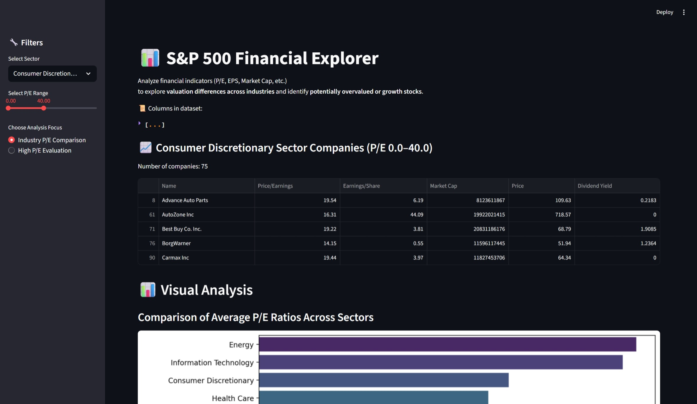
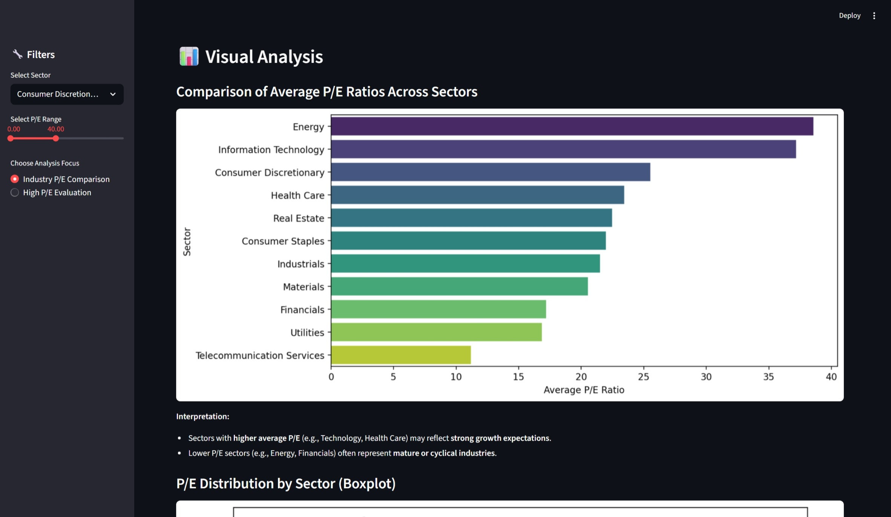
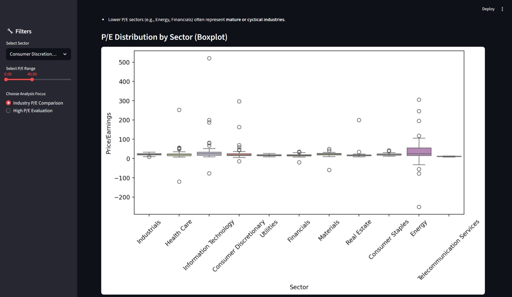

# 📊 S&P 500 Financial Explorer

**Live Demo / 在线演示： [https://s-p500-financial-explorer-khuxwvnewf23f2gpg6d7q6.streamlit.app/](https://s-p500-financial-explorer-khuxwvnewf23f2gpg6d7q6.streamlit.app/)**

探索 S&P 500 公司估值和行业差异，分析 P/E、EPS、Market Cap 等关键财务指标。  
Explore valuation differences across S&P 500 companies and sectors by analyzing key financial indicators such as P/E, EPS, and Market Cap.

---

## ⚡ Features / 功能特点

- **Interactive filtering by sector and P/E range / 通过行业和市盈率范围交互筛选**  
- **Dynamic visualizations: Bar chart, Scatter plot, Boxplot / 动态可视化：柱状图、散点图、箱线图**  
- **Filtered companies table with scrollable view / 可滚动查看筛选后的公司列表**  
- **Compare industry P/E and identify potentially overvalued or growth stocks / 对比行业 P/E，发现可能高估或成长股**

---

## 🛠 Interactive Components / 功能组件说明

- **Select Sector / 选择行业 (下拉菜单 selectbox)**  
  Choose a sector to filter companies / 选择一个行业，筛选对应公司数据

- **Select P/E Range / 市盈率范围 (滑块 slider)**  
  Adjust P/E range to filter companies dynamically / 调整 P/E 区间，动态过滤公司

- **Choose Analysis Focus / 分析类型选择 (单选 radio)**  
  Select analysis mode:  
  - Industry P/E Comparison / 行业平均 P/E  
  - High P/E Evaluation / 高 P/E 股票评估

- **Filtered Companies Table / 筛选公司表格 (dataframe)**  
  Displays company name, P/E, EPS, Market Cap, Price, Dividend Yield / 显示公司名称、P/E、EPS、市值、股价、股息率

- **Visualizations / 可视化图表**  
  Analyze valuation trends and identify potential overvalued or growth stocks / 分析估值趋势，发现潜在高估或成长股


💡 作用说明 / Purpose:
这些组件实现了至少两个交互控件和动态数据分析，让用户可以实时探索行业与公司估值情况。

## 🗂 Project Structure / 项目结构

```
S&P500-Financial-App/
 ┣ S&P500 Financial Explorer.py      # Main Streamlit application / 主应用文件
 ┣ financials.csv                    # Dataset containing financial metrics / 财务数据 CSV
 ┣ requirements.txt                  # Required Python packages / 依赖包列表
 ┗ README.md                         # This file / 本文件
```

---

## ⚡ Features / 功能特点

1. **Interactive Filters / 交互筛选**

   * Select a **sector** from dropdown / 下拉选择行业
   * Adjust **P/E ratio range** using a slider / 使用滑块调整市盈率范围
   * Choose analysis focus / 选择分析类型:

     * Industry P/E Comparison / 行业平均 P/E 比较
     * High P/E Evaluation (EPS vs P/E) / 高 P/E 股票评估 (EPS vs P/E)

2. **Dynamic Tables & Data / 动态表格与数据**

   * Display filtered companies / 显示筛选后的公司
   * Key columns / 主要列: Name, P/E, EPS, Market Cap, Price, Dividend Yield
   * 主要字段: 公司名称, 市盈率, 每股收益, 市值, 股价, 股息率

3. **Visual Analysis / 可视化分析**

   * **Bar Chart:** Average P/E ratio per sector / 各行业平均 P/E 柱状图
   * **Scatter Plot:** EPS vs P/E to identify potential growth or overvalued stocks / EPS 与 P/E 散点图，分析潜在成长股或高估股
   * **Boxplot:** P/E distribution across sectors / 不同行业 P/E 分布箱线图

4. **Summary Insights / 总结洞察**

   * Highlights high-growth sectors (e.g., Technology, Healthcare) / 强调高成长行业，如科技、医疗
   * Highlights mature sectors (e.g., Energy, Financials) / 强调成熟行业，如能源、金融
   * Helps compare EPS with P/E to understand valuation premiums / 对比 EPS 与 P/E 以判断估值合理性

---

## 📊 Screenshots / 截图


*Home page / 首页*





*Visual analysis charts / 可视化分析图表*

---

## 🚀 How to Run / 如何运行

1. **Clone the repository / 克隆仓库**

```bash
git clone <your-repo-url>
cd S&P500-Financial-App
```

2. **Install dependencies / 安装依赖**

```bash
pip install -r requirements.txt
```

3. **Run the Streamlit app / 运行 Streamlit 应用**

```bash
streamlit run "S&P500 Financial Explorer.py"
```

The app will open in your browser at `http://localhost:8501`.
应用将在浏览器打开，地址为 `http://localhost:8501`。

---

## 🛠 Dependencies / 依赖包

* Python 3.8+
* [streamlit](https://streamlit.io/)
* [pandas](https://pandas.pydata.org/)
* [matplotlib](https://matplotlib.org/)
* [seaborn](https://seaborn.pydata.org/)

---

## 📈 Dataset / 数据集

* Source: Your CSV file (`financials.csv`) containing financial indicators of S&P 500 companies.
  数据来源：CSV 文件 `financials.csv`，包含标普500公司的财务指标。
* Key columns / 主要列:

  * `Name` — Company name / 公司名称
  * `Sector` — Industry sector / 行业
  * `Price/Earnings` — P/E ratio / 市盈率
  * `Earnings/Share` — EPS / 每股收益
  * `Market Cap` — Market capitalization / 市值
  * `Price` — Stock price / 股价
  * `Dividend Yield` — Dividend yield / 股息率

---

## ✅ Summary / 总结

This app provides a **user-friendly interface** for exploring S&P 500 financial data, analyzing industry valuation trends, and identifying companies with potential growth or overvaluation.
It demonstrates the use of **interactive widgets**, **dynamic filtering**, and **visual analytics** with Streamlit.

本应用提供了**友好的交互界面**，用于探索标普500财务数据、分析行业估值趋势，并识别潜在成长股或高估股。
展示了 **交互控件**、**动态筛选** 和 **可视化分析** 在 Streamlit 中的应用。

---

## 📌 Author / 作者

**Zhan Ding**

